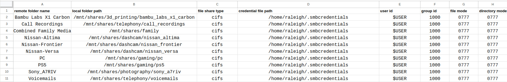

# About

This is a very simple Python script for generating `/etc/fstab` remote mounts, specifically catered towards Samba (SMB) shares.

I have a NAS with over 20 attached folders, so setting up shares manually would've taken too long and been too error-prone.

By filling out a simple CSV file and creating a credentials file, you can have a formatted `/etc/fstab` generated for you.



In addition to the formatting, this script can automatically retrieve user and group IDs from the username provided, which is useful for systems with multiple users.

# Usage

```
usage: fstab_generator_for_smb.py [-h] -f INPUT_CSV_FILE -i REMOTE_IP_ADDRESS [-r REMAINING_TEXT]

options:
  -h, --help            show this help message and exit
  -f INPUT_CSV_FILE, --input-csv-file INPUT_CSV_FILE
                        The CSV filepath to read from
  -i REMOTE_IP_ADDRESS, --remote-ip-address REMOTE_IP_ADDRESS
                        The IP address of the remote share. Only tested with IPv4
  -r REMAINING_TEXT, --remaining-text REMAINING_TEXT
                        Any remaining text to add in the line
```